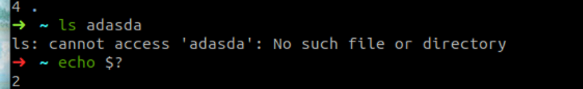
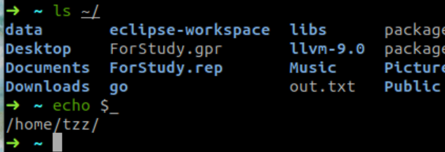

# MIT-Missing-Semester

预计11H左右

网址：

【Letcture】[2020 Lectures · the missing semester of your cs education (mit.edu)](https://missing.csail.mit.edu/2020/ "2020 Lectures · the missing semester of your cs education (mit.edu)")

【vedio】[\[MIT\]计算机科学课堂中学不到的知识 The Missing Semester of Your CS Education(2020)\_哔哩哔哩\_bilibili](https://www.bilibili.com/video/BV1x7411H7wa/?spm_id_from=333.337.search-card.all.click\&vd_source=520389f0de5508bac7e03879bf4e78b7 "\[MIT]计算机科学课堂中学不到的知识 The Missing Semester of Your CS Education(2020)_哔哩哔哩_bilibili")

# 1.Shell

Bash通过空格来分开参数【可以使用""或者 `\`来合成一个参数】

通过`which`可以知道shell是在哪里找到的命令

`cd -`：返回之前目录【上次目录】

`>`：左边为input，传向右边的程序&#x20;

`<`：右边有input，传向左边的程序

`>>`：意味着`append`

`tail`：打印最后行

```bash
$ sudo find -L /sys/class/backlight -maxdepth 2 -name '*brightness*'
/sys/class/backlight/thinkpad_screen/brightness
$ cd /sys/class/backlight/thinkpad_screen
$ sudo echo 3 > brightness
An error occurred while redirecting file 'brightness'
open: Permission denied
```

因为我们的`>,|,<`仅仅知识改变shell的输入流和输出流，而程序是一无所知的

所以`sudo echo 3 > brightness`我们的`sudo`只是表示我们以`root`权限执行`echo`但是输出还仍然是shell在用户态下通过`>`来传给`brightness`（用户态打开）的。

所以我们可以使用`sudo tee`来使用root权限来写入。

`xdg-open`命令：能够通过`xdg-open .`打开文件夹

其本质是`Opens a file or URL in the user's preferred application`

当传入参数是`路径`就可以打开文件夹

当传入参数是PDF或者html可以用我们默认的打开方式来打开文件。

# 2.shell tools and script

## 2.1 shell

`for = bar`如果中间有空格就会失败，因为bash会将` `来分割参数。

echo中使用`""`可以表示`$foo`也就是变量，

但是使用` `` `不会导入变量

`$0`表示当前文件名字，`$1`表示你输入空格之后的第一个参数。

*   `$@` - 所有参数

*   `$#` - 参数个数

*   `$$` - 当前脚本的进程识别码

`$?`表示前一个命令的`error code`

*   `$_` - 上一条命令的最后一个参数。如果你正在使用的是交互式 shell，你可以通过按下 `Esc` 之后键入 . 来获取这个值。





`!!` - 完整的上一条命令，包括参数。常见应用：当你因为权限不足执行命令失败时，可以使用 `sudo !!`再尝试一次。

short-circuiting：短路运算符。

`False || 命令`：当第一个为false时，执行后续命令。

`True || 命令`：当第一个为true时，后续命令不在执行。

`&&`与之类似。

当通过 `$( CMD )` 这样的方式来执行`CMD` 这个命令时，它的输出结果会替换掉 `$( CMD )` 。例如，如果执行 `for file in $(ls)` ，shell首先将调用`ls` ，然后遍历得到的这些返回值。

还有一个冷门的类似特性是 *进程替换*（*process substitution*）， `<( CMD )` 会执行 `CMD` 并将结果输出到一个临时文件中，并将 `<( CMD )` 替换成临时文件名。这在我们希望返回值通过文件而不是STDIN传递时很有用。例如， `diff <(ls foo) <(ls bar)` 会显示文件夹 `foo` 和 `bar` 中文件的区别。

bash之中写脚本

```bash
#!/bin/bash

echo "Starting program at $(date)" # date会被替换成日期和时间

echo "Running program $0 with $# arguments with pid $$"

for file in "$@"; do
    grep foobar "$file" > /dev/null 2> /dev/null
    # 如果模式没有找到，则grep退出状态为 1
    # 我们将标准输出流和标准错误流重定向到Null，因为我们并不关心这些信息
    if [[ $? -ne 0 ]]; then
        echo "File $file does not have any foobar, adding one"
        echo "# foobar" >> "$file"
    fi
done
```

这里我们可以知道:

*   循环语句使用`do`和`done`作为开始和结束的标志

*   判断语句使用`then`和`fi`作为开始和结束的标志

*   判断语句使用`[[]]`来存放判断语句

*   `-ne`表示数值的不等于【关于判断我们可以使用`man test`来找到一些列判断语句】

*   注意我们对于空格一定要敏感，我在敲这个代码的时候，发现自己的`2 > /dev/null`多了一个空格，这个时候grep命令就会执行失败，所以我们不可以随便更改空格。

*   这里的`2>`表示将错误流转向，注意一定要没有空格。

我们bash中的`#!...`是一个sebang告诉

通常我们可以使用`#!/bin/usr/local/python`，但是如果我们的python安装位置懒的找，我们可以使用这样一条语句：`#!/usr/bin/env python`，这样可以执行在任何计算机下。

tips:`/usr/bin/env`也是一个二进制命令，我们可以通过其启动用户env内的程序。

工具：shellcheck可以来检测我们bash的语法。

shell函数和脚本有如下一些不同点：

*   函数只能与shell使用相同的语言，脚本可以使用任意语言。因此在脚本中包含 `shebang` 是很重要的。

*   函数仅在定义时被加载，脚本会在每次被执行时加载。这让函数的加载比脚本略快一些，但每次修改函数定义，都要重新加载一次。

*   函数会在当前的shell环境中执行，脚本会在单独的进程中执行。因此，函数可以对环境变量进行更改，比如改变当前工作目录，脚本则不行。脚本需要使用 [export](httsp://man7.org/linux/man-pages/man1/export.1p.html "export") 将环境变量导出，并将值传递给环境变量。

*   与其他程序语言一样，函数可以提高代码模块性、代码复用性并创建清晰性的结构。shell脚本中往往也会包含它们自己的函数定义。

## 2.2 tools

*   `convert`：我们可以使用其修改img

*   `ffmpeg`：我们可以使用其修改video【Video conversion tool】

### 2.2.1 查找文件：我们使用find来查找文件

```bash
# 查找所有名称为src的文件夹
find . -name src -type d
# 查找所有文件夹路径中包含test的python文件
find . -path '*/test/*.py' -type f
# 查找前一天修改的所有文件
find . -mtime -1
# 查找所有大小在500k至10M的tar.gz文件
find . -size +500k -size -10M -name '*.tar.gz'
# 删除全部扩展名为.tmp 的文件
find . -name '*.tmp' -exec rm {} \;
# 查找全部的 PNG 文件并将其转换为 JPG
find . -name '*.png' -exec convert {} {}.jpg \;

```

还能对查找的文件进行操作。

记住，shell 最好的特性就是您只是在调用程序，因此您只要找到合适的替代程序即可（甚至自己编写）。

例如`fd`就是一个更好用的替代品它有很多不错的默认设置，例如输出着色、默认支持正则匹配、支持unicode并且我认为它的语法更符合直觉。以模式`PATTERN` 搜索的语法是 `fd PATTERN`。

大多数人都认为 `find` 和 `fd` 已经很好用了，但是有的人可能想知道，我们是不是可以有更高效的方法，例如不要每次都搜索文件而是通过编译索引或建立数据库的方式来实现更加快速地搜索。

这就要靠 [locate](https://man7.org/linux/man-pages/man1/locate.1.html "locate") 了。 `locate` 使用一个由 [updatedb](https://man7.org/linux/man-pages/man1/updatedb.1.html "updatedb")负责更新的数据库，在大多数系统中 `updatedb` 都会通过 [cron](https://man7.org/linux/man-pages/man8/cron.8.html "cron") 每日更新。这便需要我们在速度和时效性之间作出权衡。而且，`find` 和类似的工具可以通过别的属性比如文件大小、修改时间或是权限来查找文件，`locate`则只能通过文件名。 [这里](https://unix.stackexchange.com/questions/60205/locate-vs-find-usage-pros-and-cons-of-each-other "这里")有一个更详细的对比。

### 2.2.2 查找代码

`grep` 有很多选项，这也使它成为一个非常全能的工具。其中我经常使用的有 `-C` ：获取查找结果的上下文（Context）；`-v` 将对结果进行反选（Invert），也就是输出不匹配的结果。举例来说， `grep -C 5` 会输出匹配结果前后五行。当需要搜索大量文件的时候，使用 `-R` 会递归地进入子目录并搜索所有的文本文件。

因此也出现了很多它的替代品，包括 [ack](https://beyondgrep.com/ "ack"), [ag](https://github.com/ggreer/the_silver_searcher "ag") 和 [rg](https://github.com/BurntSushi/ripgrep "rg")。它们都特别好用，但是功能也都差不多，我比较常用的是 ripgrep (`rg`) ，因为它速度快，而且用法非常符合直觉。例子如下：

```bash
# 查找所有使用了 requests 库的文件
rg -t py 'import requests'
# 查找所有没有写 shebang 的文件（包含隐藏文件）
rg -u --files-without-match "^#!"
# 查找所有的foo字符串，并打印其之后的5行
rg foo -A 5
# 打印匹配的统计信息（匹配的行和文件的数量）
rg --stats PATTERN
```

与 `find`/`fd` 一样，重要的是你要知道有些问题使用合适的工具就会迎刃而解，而具体选择哪个工具则不是那么重要。

### 2.2.3 查找 shell 命令

*   首先，按向上的方向键会显示你使用过的上一条命令，继续按上键则会遍历整个历史记录。

`history` 命令允许您以程序员的方式来访问shell中输入的历史命令。这个命令会在标准输出中打印shell中的里面命令。如果我们要搜索历史记录，则可以利用管道将输出结果传递给 `grep` 进行模式搜索。 `history | grep find` 会打印包含find子串的命令。

*   对于大多数的shell来说，您可以使用 `Ctrl+R` 对命令历史记录进行回溯搜索。敲 `Ctrl+R` 后您可以输入子串来进行匹配，查找历史命令行。反复按下就会在所有搜索结果中循环。在 [zsh](https://github.com/zsh-users/zsh-history-substring-search "zsh") 中，使用方向键上或下也可以完成这项工作。
